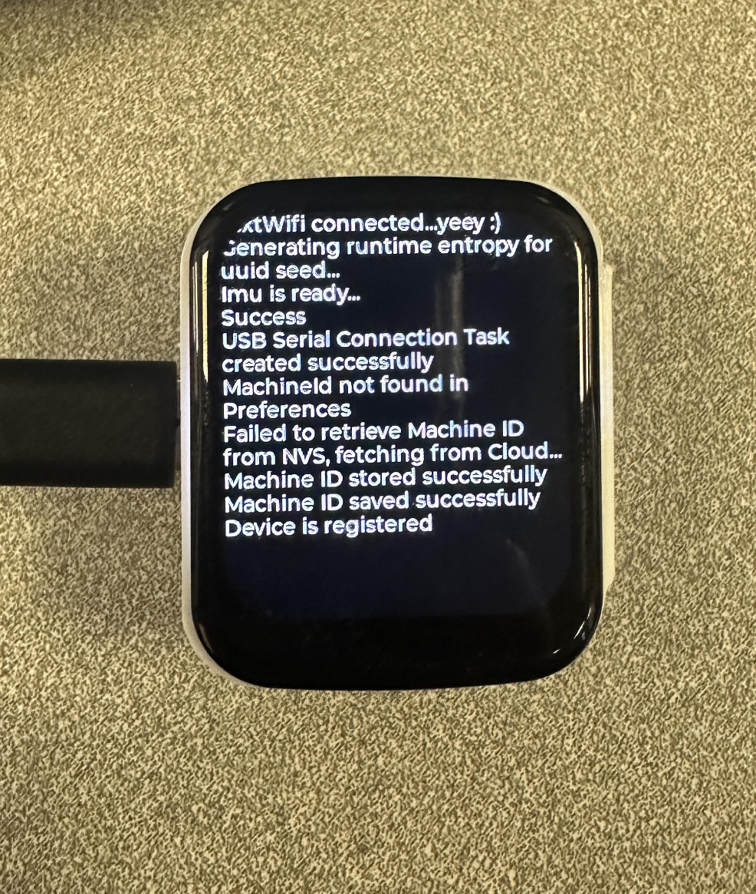

# Getting Started
This guide provides step-by-step instructions to help you set up your **Connectivity Control Calibration (C3)** device and integrate it with your 3D printer. By following this process, you'll be able to remotely control your printer and perform calibrations through our CaaSUI dashboard.

## Step 1: Create an Account
To get started, visit the [CaaSUI website](https://beta.d11dolnrbc1eee.amplifyapp.com/) and create an account:

1. Click on the **Create Account** tab.
2. Enter your details, including your email address and a secure password.
3. Verify your email address by entering the confirmation code sent to your inbox.

Once your account is created, you can log in to access the dashboard.

## Step 2: Power On Your C3 Device
Unbox your **C3** device and connect it to a power source using the provided cable and USB-C adapter. The device will automatically power on, and the built-in screen will display the **Chip ID** and a status message indicating it's ready for setup.

{: .info }
> Make sure the device is placed near a stable Wi-Fi connection for seamless operation.

## Step 3: Connect your C3 device to WiFi
To connect your **C3** device to the internet, follow these steps:

1. **Device Wi-Fi Access Point**: Once powered on, your **C3** device will automatically create its own Wi-Fi network. The network name will appear on your computer or smartphone's Wi-Fi settings (e.g., **AutoConnectAP**).
2. **Connect to the Device’s Network**: On your computer or smartphone, go to the Wi-Fi settings and connect to the **AutoConnectAP** network.
3. **Access the Wi-Fi Manager**: After successfully connecting to the device’s Wi-Fi, your browser will automatically open the **Wi-Fi Manager** page. If this doesn’t happen, open your browser manually and navigate to `http://192.168.4.1`.
4. **Choose Your Wi-Fi Network**: On the Wi-Fi Manager page, you will see a list of available Wi-Fi networks. Select your desired network and enter the Wi-Fi network credentials (SSID and password).
5. **Save and Connect**: After entering the correct network details, click **Save** to establish the connection. The **C3** device will attempt to connect to the Wi-Fi network. Once successful, the home screen on the device will display a **Wi-Fi Connected** icon indicator.
6. **Confirm Connection**: Your **C3** device will now be connected to your Wi-Fi network, and you can proceed with device registration in the next step.

  
  
  
  

{: .info }
> For optimal performance, ensure your device is within the range of a stable Wi-Fi signal. If you experience any connection issues, try moving the device closer to your router or use a Wi-Fi extender.

## Step 4: Add Your Device to the Dashboard
Integrate your **C3** device with your account by following these steps:

1. Log in to your dashboard at [CaaSUI](https://beta.d11dolnrbc1eee.amplifyapp.com/).
2. Navigate to the **Inventory** section and click on the **Add Device** button.
3. Enter your 3D printer's name, make, model, and most importantly the **Chip ID** displayed on the screen of your **C3** device.
4. Click **Submit** to register your device.
5. Restart your C3 device by pressing the reset button (lowest button).

Swiping to the left screen on your C3 device, you will see a message indicating that the device is registered. If the device is successfully registered, it will appear in your device list with its current status and controls.

  
  

## Step 5: Begin Using Your C3 Device
Once added, your **C3** device is ready for use. Through the dashboard, you can:

- Monitor and control your printer remotely:
  1. Navigate to the **Inventory** section and click on the **By Machines** tab.
  2. Locate the machine that is registered by identifying the name given to the 3D printer, and click on the remote control button under the **Actions** column.
  3. You will be greeted by the controls page where you can start remotely controlling your 3D printer.
- Start calibration routines or prints.
- Analyze performance data collected during operation.

{: .warning }
> Ensure your printer is free of obstacles before starting any movement or calibration commands. Follow the safety guidelines provided in the user manual.

  
  

## Troubleshooting
If you encounter issues during setup, refer to the [Troubleshooting Guide](https://example.com/troubleshooting) or contact our support team for assistance.
